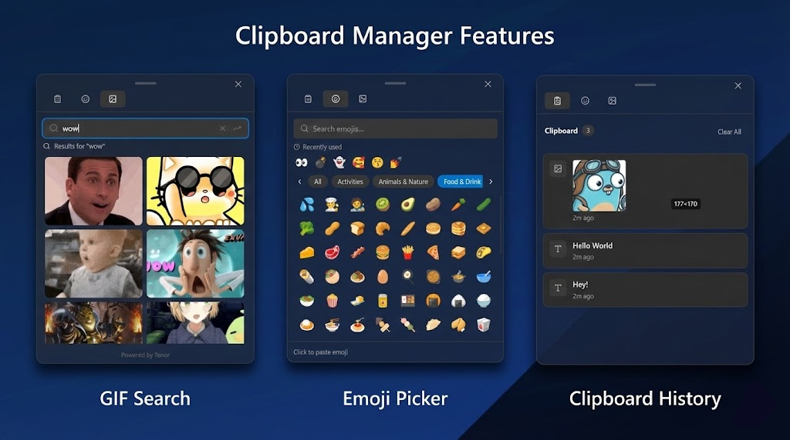
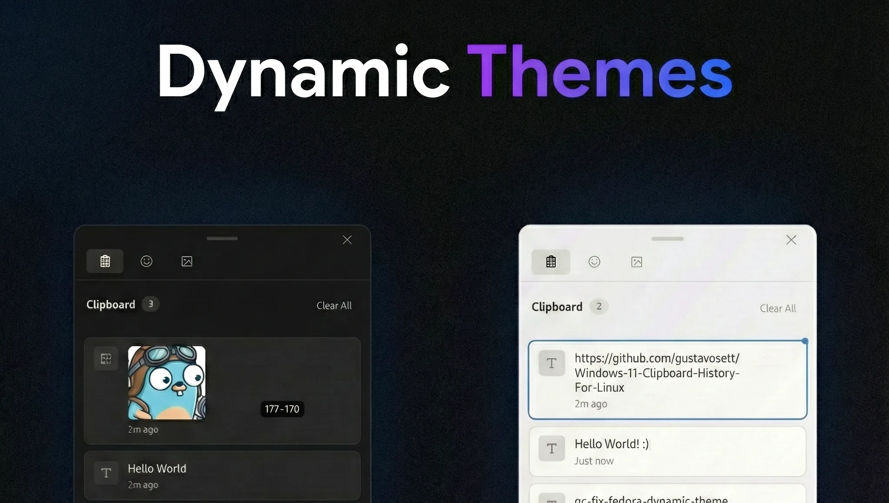

<div align="center">

# 📋 Windows 11 Style Clipboard History Manager
### مدیر تاریخچه کلیپ‌بورد به سبک ویندوز ۱۱ برای لینوکس

> A fast, bilingual clipboard manager for Linux (Wayland & X11), inspired by Windows 11 Win+V.
> مدیر کلیپ‌بورد سریع و دوزبانه برای لینوکس، با الهام از Win+V ویندوز ۱۱.

[](LICENSE)
[](https://tauri.app/)
[](https://www.rust-lang.org/)
[](https://react.dev/)
[]()

<br/>



</div>

---

## Documentation / مستندات

- [راهنمای جامع فارسی](docs/USER_GUIDE.fa.md)
- [درگاه مستندات فنی فارسی](docs/fa/README.md)
- [Complete English guide](docs/USER_GUIDE.en.md)
- [Archive of review & QA reports / آشیانهٔ گزارش‌های بازبینی](docs/archive/reports/)
- [Performance budget / بودجهٔ عملکرد](docs/PERFORMANCE.md)
- [Packaging and release / بسته‌بندی و انتشار](packaging/README.md)

---

## Features / ویژگی‌ها

| | English | فارسی |
| --- | --- | --- |
| 🐧 | Wayland and X11 | پشتیبانی Wayland و X11 |
| ⚡ | `Super+V` / `Ctrl+Alt+V` | میانبر فوری |
| 🌐 | Persian + English in Setup/Settings; main popup stays English/LTR | فارسی و انگلیسی در راه‌اندازی/تنظیمات؛ پنجرهٔ اصلی انگلیسی و LTR می‌ماند |
| 📌 | Pin important items | سنجاق آیتم‌های مهم |
| 🤩 | Emoji, kaomoji, symbols | ایموجی، کائوموجی، نماد |
| 🛡️ | Local SQLite history, secret filter | تاریخچه محلی، فیلتر اسرار |
| 🔑 | Key file **or** Secret Service keyring | کلید در فایل **یا** کلید-ring دسکتاپ |
| 🎨 | Acrylic UI, light/dark/system | ظاهر شیشه‌ای، تم سیستم |
| 🔍 | Search with optional regex | جستجو با regex اختیاری |
| 🔒 | Fully offline — bundled fonts, zero runtime network | کاملاً آفلاین — فونت محلی، بدون اتصال شبکه |

<p align="center">
  
</p>

---

## Privacy / حریم خصوصی

Clipboard history is stored **only on this machine**:

- Database: `~/.local/share/windows-11-style-clipboard-history-manager/history.db` (mode `0600`, text columns encrypted at rest)
- Images: `~/.local/share/windows-11-style-clipboard-history-manager/images/` (ChaCha20-Poly1305 at rest; UI gets a thumbnail)
- Settings: `~/.config/windows-11-style-clipboard-history-manager/user_settings.json`
- Encryption key: `history.key` (mode `0600`) next to the database — **or** the
  freedesktop Secret Service keyring (Settings → Privacy, see
  [ADR-0006](docs/adr/0006-secret-service-key-storage.md)); the active key is
  anchored by the `history.key.check` marker and never swapped silently

**Defaults (on):**

- Skip private keys, API tokens, JWTs, and `password=` values (any length)
- Skip password-manager and private-browsing windows on **X11** (Wayland compositors do not expose the focused app)
- Save images (can be turned off)

History size is capped at **2000** items. Persistence is incremental (upsert/delete), not a full rewrite on every copy. Encryption is **fail-closed**: a ChaCha20-Poly1305 error never stores plaintext.

**Network:** the app does not upload clipboard contents, and in normal operation it makes **zero network calls** — the Vazirmatn font is bundled locally (see `public/fonts/OFL.txt`). GIF search (optional, currently hidden) requires `TENOR_API_KEY` in the environment and only talks to Tenor over pinned HTTPS with SSRF validation + DNS pinning.

This project needs `/dev/uinput` (or XTest) to simulate Ctrl+V. That is a powerful permission — treat the binary like a trusted input device. An optional AppArmor profile (complain mode by default, `--enforce` available) is shipped in `packaging/apparmor/`.

Tiling window managers (i3 / Sway / Hyprland) are **not** rewritten unless you enable *Allow rewriting tiling WM configs* in Settings.

**Supply chain:** the installer **mandatorily verifies** every download against the release's `SHA256SUMS` (set `ALLOW_UNVERIFIED=1` to skip — not recommended); optional GPG verification of the checksum file via `WINDOWS_11_CLIPBOARD_TRUST_KEY`. The hardened CI contract ([`docs/CI.md`](docs/CI.md)) **blocks** on `cargo audit`, `cargo deny` (advisories/bans/licenses/sources), `npm audit --audit-level=high`, type-aware ESLint + `tsc`, frontend coverage thresholds, `cargo test` (default and `--all-features`), `clippy -D warnings`, a release-binary smoke test, a Flatpak manifest/metainfo lint, and the packaging contract (`scripts/check-packaging.sh`). Every GitHub Action is pinned to a full commit SHA (OpenSSF recommendation). Each release publishes `SHA256SUMS`, an optional GPG `SHA256SUMS.sig`, a **per-artifact** SPDX SBOM (syft), and SLSA build-provenance attestations. The AUR push fails closed unless verified SSH host keys are configured (`AUR_KNOWN_HOSTS`). The hardened, canonical-named pipelines (`ci.yml`, `release.yml`, a manual `e2e.yml` Playwright workflow, `stale.yml`) are **ready to activate with one maintainer step** — the final activation patch is archived at [`docs/archive/patches/hardened-ci-workflows.patch`](docs/archive/patches/hardened-ci-workflows.patch):

```bash
git am docs/archive/patches/hardened-ci-workflows.patch && git push
```

After that, [`.github/workflows/`](.github/workflows/) is the single source of truth (the old `docs/github-workflows/` mirror is gone). See [docs/THREAT_MODEL.md](docs/THREAT_MODEL.md) and [docs/adr/](docs/adr/).

---

## Installation / نصب

Prefer your package manager over piping scripts to `bash`. Verify `SHA256SUMS` from GitHub Releases.

### Debian / Ubuntu

```bash
sudo apt install ./windows-11-style-clipboard-history-manager_2.5.0_amd64.deb
sudo setfacl -m u:$USER:rw /dev/uinput
```

Download the `.deb` from [GitHub Releases](https://github.com/Mahdi-Arts/Windows-11-Style-Clipboard-History-Manager/releases) after verifying the published checksum.

### Fedora

```bash
sudo dnf install ./windows-11-style-clipboard-history-manager-2.5.0-1.x86_64.rpm
sudo setfacl -m u:$USER:rw /dev/uinput
```

### Arch Linux (AUR)

```bash
yay -S windows-11-style-clipboard-history-manager-bin
```

### Flatpak

See [`packaging/README.md`](packaging/README.md). The Flatpak sandbox does **not** grant `/dev/uinput`; use the `.deb`/`.rpm` for paste simulation, or:

```bash
flatpak override --user --device=all io.github.mahdi-arts.clipboard-history
```

### Convenience installer (review before running)

```bash
curl -fsSL https://raw.githubusercontent.com/Mahdi-Arts/Windows-11-Style-Clipboard-History-Manager/master/scripts/install.sh -o install-clipboard.sh
less install-clipboard.sh
bash install-clipboard.sh
```

The installer **requires** matching the downloaded artifact against the release's `SHA256SUMS` and aborts on mismatch. Optional GPG verification of the checksum file is available via `WINDOWS_11_CLIPBOARD_TRUST_KEY=<keyid>`.

---

## Shortcuts / میانبرها

| Key | Action |
| --- | --- |
| <kbd>Super</kbd>+<kbd>V</kbd> | Open clipboard history |
| <kbd>Super</kbd>+<kbd>.</kbd> | Open emoji picker |
| <kbd>Ctrl</kbd>+<kbd>Alt</kbd>+<kbd>V</kbd> | Alternative shortcut |
| <kbd>Enter</kbd> | Paste selected item |
| <kbd>Esc</kbd> | Close |
| <kbd>Ctrl</kbd>+<kbd>F</kbd> | Search |

---

## Architecture / معماری

Full diagram: [`docs/ARCHITECTURE.md`](docs/ARCHITECTURE.md).

| Layer | Stack |
| --- | --- |
| UI | React 19, TypeScript, Tailwind CSS 4, lazy-loaded pickers |
| Backend | Rust, Tauri v2 (shortcut backends split per-DE) |
| Clipboard I/O | arboard + `wl-copy` / `xclip` |
| Monitoring | Event-driven wakeups (XFixes on X11, `wl-paste --watch` on Wayland) with adaptive polling fallback |
| Persistence | SQLite (WAL) + ChaCha20-Poly1305 field **and image** encryption, atomic JSON |
| Key storage | `history.key` (0600) or Secret Service keyring — marker-verified, fail-closed ([ADR-0006](docs/adr/0006-secret-service-key-storage.md)) |
| IPC | Default paged reads (`get_history_page`, [ADR-0007](docs/adr/0007-ipc-pagination.md)); `get_history` is a clamped first page |
| Input | Persistent uinput device (Wayland) / XTest (X11), paste tickets |
| Fonts | Bundled Vazirmatn (SIL OFL 1.1) — zero runtime network calls |
| Security | CSP (`font-src 'self'`), `withGlobalTauri: false`, SSRF allowlist + DNS pin, Rust `open_safe_url`, paste tickets, mandatory checksum verification |

---

## Troubleshooting / عیب‌یابی

| Issue | Fix |
| --- | --- |
| Shortcut does nothing on GNOME | GNOME reserves Super+V. Rebind notification tray, or use Ctrl+Alt+V. Reset: `rm ~/.config/windows-11-style-clipboard-history-manager/setup.json` |
| Black / opaque window on NVIDIA | `IS_NVIDIA=1 windows-11-style-clipboard-history-manager` |
| Paste does nothing | `sudo setfacl -m u:$USER:rw /dev/uinput` then log out/in |
| Window missing on Wayland | Run from a terminal and read the log in `~/.local/share/windows-11-style-clipboard-history-manager/logs/` |
| Password manager still captured | On Wayland, focused-app skip is unavailable. Keep *Skip secrets* on. |

---

## Development / توسعه

Requires **Node ≥ 20.19** (Vite 7 floor; `.nvmrc` pins 20) and a Rust
toolchain as pinned by `rust-toolchain.toml`.

```bash
git clone https://github.com/Mahdi-Arts/Windows-11-Style-Clipboard-History-Manager.git
cd Windows-11-Style-Clipboard-History-Manager
make deps && make rust && make node
source ~/.cargo/env
make dev          # hot reload
make test         # frontend + Rust unit tests
make lint
make packaging    # release-name / version / deb-rpm parity contracts
make build
```

Frontend tests include component tests (Testing Library + jsdom) and a **coverage gate**:

```bash
npm run test:coverage   # coverage thresholds enforced / آستانهٔ پوشش الزامی
```

### E2E Testing with Playwright

Comprehensive end-to-end tests are available using Playwright:

```bash
# Install Playwright browsers
npm run test:e2e:playwright:install

# Run E2E tests
npm run test:e2e:playwright

# Run with UI mode (watch mode)
npm run test:e2e:playwright:ui

# Run in headed mode (see browser)
npm run test:e2e:playwright:headed

# Debug mode
npm run test:e2e:playwright:debug

# View HTML report
npm run test:e2e:playwright:report
```

E2E test suites cover:
- **Application Launch**: Window management, UI rendering, theming
- **Clipboard History**: Item display, search, pin/delete actions
- **Paste Operations**: Keyboard shortcuts, throttling, authorization
- **Tab Navigation**: Lazy-loaded pickers (emoji, kaomoji, symbols)
- **Settings & Privacy**: Theme, privacy controls, language support
- **System Integration**: Tray, global shortcuts, DE compatibility
- **Security**: CSP, paste tickets, SSRF protection

See [`tests/e2e/playwright/`](tests/e2e/playwright/) for test files and configuration.

CI contract: [`docs/CI.md`](docs/CI.md). The live `.github/workflows/` run the
hardened, canonical-named pipelines (SHA-pinned actions) directly, with
`.github/workflows/` (the single source of truth). The gate
**blocks** on:

- `npm run lint` (type-aware ESLint + tsc, zero warnings) — including the Playwright E2E specs
- `npm run test:coverage` (Vitest + coverage thresholds)
- `cargo test` (default and `--all-features`), `cargo clippy --all-targets -- -D warnings`, `cargo fmt --check`
- `cargo audit`, `cargo deny check` (advisories/bans/licenses/sources — see `src-tauri/deny.toml`), and `npm audit --audit-level=high` (no `continue-on-error`)
- `scripts/check-packaging.sh` (canonical names, deb/rpm parity, version drift, udev/AUR contract)
- CLI smoke: `--version` / `--help` on the release binary (bare and under `xvfb-run`)

Tagged releases publish `.deb` / `.rpm` / AppImage plus `SHA256SUMS` (with an
optional GPG `SHA256SUMS.sig`), a per-artifact SPDX SBOM, and SLSA
build-provenance attestations. All URLs point at this repository
(`Mahdi-Arts/Windows-11-Style-Clipboard-History-Manager`). Artifact
filenames are normalized at build time
(`scripts/normalize-artifacts.sh`) to the canonical lowercase package
name, so the release notes, `PKGBUILD`, installer and `SHA256SUMS` always
reference identical files.

### Environment

| Variable | Purpose |
| --- | --- |
| `IS_NVIDIA=1` | WebKit DMA-BUF workaround |
| `IS_APPIMAGE=1` | Same workaround for AppImage |
| `TENOR_API_KEY` | Optional GIF search (requires a build with `--features gif-search`) |
| `RUST_LOG=info` | Tracing level |

Packaging notes (`.deb` → GitHub Release → Flatpak deployment guide):
[`packaging/README.md`](packaging/README.md).

## Security / امنیت

- Contributing: [`.github/CONTRIBUTING.md`](.github/CONTRIBUTING.md)
- Architecture: [`docs/ARCHITECTURE.md`](docs/ARCHITECTURE.md)
- Full threat model: [`docs/THREAT_MODEL.md`](docs/THREAT_MODEL.md)
- Architecture decision records: [`docs/adr/`](docs/adr/)
- Live CI contract: [`docs/CI.md`](docs/CI.md)
- Reporting vulnerabilities: [`SECURITY.md`](.github/SECURITY.md) (GitHub private advisory — do not open public issues)

---

## License / مجوز

MIT. Based on the original [Windows 11 Clipboard History For Linux](https://github.com/gustavosett/Windows-11-Clipboard-History-For-Linux) by gustavosett.

Security reports: use [GitHub private advisories](https://github.com/Mahdi-Arts/Windows-11-Style-Clipboard-History-Manager/security/advisories/new) — do not open a public issue.
